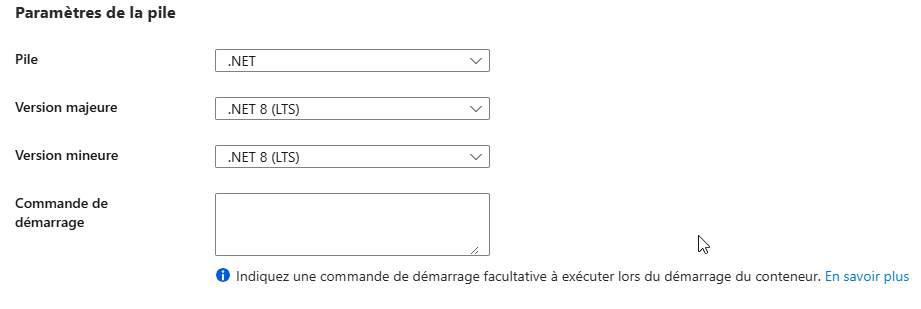
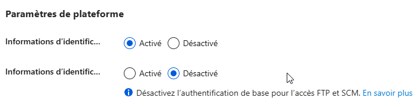

[](https://github.com/adrien-hh/tp-deploiement/actions/workflows/docker-publish.yml)

# 🧪 TP – Déploiement CI/CD d'une Web API .NET 8 sur Azure

## 🎯 Objectif

À partir d’une Web API en .NET 8 fournie, vous devez :

1. Créer une **Azure Web App** (Linux, .NET 8)
2. Mettre en place un pipeline **CI/CD avec GitHub Actions**
3. Automatiser les étapes de :
   - Compilation
   - Tests
   - Publication sur Azure

---

## 🧰 Pré-requis

- Un **compte GitHub**
- Un **compte Azure**
- Le **code fourni** (Web API .NET 8)
- Visual Studio / VS Code
- Git installé
- Avoir .net 8 sur le poste 

 ---

## 📦 Partie 1 – Récupération du projet

Clonez le projet de démarrage :

```bash
git clone <url>
cd webapi-starter-dotnet8
```

> Le projet à builder se trouve dans le dossier `MyWebApi`

Testez le lancement local :

```bash
dotnet run --project MyWebApi/MyWebApi.csproj
```
- De base vous aller voir afficher _hello word_

- si vous rajouter /swagger a la fin de l'url 

---

## ☁️ Partie 2 – Création de la Web App sur Azure

1. Connectez-vous à [https://portal.azure.com](https://portal.azure.com)
2. Créez une **Web App** :
   - **Nom** : `webapi-votreprenom`
   - **Runtime** : `.NET 8`
   - **Système** : `Linux`
   - **Région** : Europe ou proche
   - **Plan App Service** : Gratuit (F1) ou B1
3. Accédez à la Web App > **Centre de déploiement** > **Configurer manuellement plus tard**
3. Accédez à la Web App > Parametres > Configuration 
    - Verifier que **Paramètres de la pile**
     

    - Dans les **Paramètres de plateforme** activer le SCM
     


4. Allez dans **"Profil de publication"** :
   - Téléchargez le **fichier XML**
   - Gardez ce fichier pour l’étape GitHub

> il se peut que ce ne soit pas aussi facile ;)
---

## 🔐 Partie 3 – Configuration des secrets GitHub & création du pipeline

### 🔑 Étape 1 – Ajouter les secrets GitHub

1. Allez sur votre dépôt GitHub
2. Ouvrez l’onglet **`Settings`** > **`Secrets and variables`** > **`Actions`**
3. Cliquez sur **`New repository secret`**

Ajoutez ces deux secrets :

| Nom du secret             | Valeur |
|---------------------------|--------|
| `AZURE_WEBAPP_NAME`       | Nom de votre Web App (ex. `webapi-votreprenom`) |
| `AZURE_PUBLISH_PROFILE`   | **Contenu** du fichier XML de profil de publication |

> 📄 Pour récupérer le `AZURE_PUBLISH_PROFILE`, ouvrez le fichier `.PublishSettings` téléchargé depuis Azure, copiez tout son contenu, et collez-le dans le champ du secret.

---

### ⚙️ Étape 2 – Créer le pipeline à partir d’un template

GitHub propose des **modèles de workflow**. Pour créer votre pipeline :

1. Allez dans l’onglet **`Actions`** de votre dépôt GitHub
2. Cliquez sur **`Configure`** à côté de **"Deploy .NET Core app to an Azure Web App"**
3. Dans le fichier généré (`azure-webapps-dotnet-core.yml`) :
   - Remplacez `myappname` par `\${{ secrets.AZURE_WEBAPP_NAME }}`
   - Remplacez `<publish-profile>` par `\${{ secrets.AZURE_PUBLISH_PROFILE }}`
   - Modifiez le chemin du projet `.csproj` si nécessaire (ex : `MyWebApi/MyWebApi.csproj`)
4. Sauvegardez et validez le fichier dans `.github/workflows/`

> 🧠 Cela vous permet de gagner du temps tout en personnalisant votre pipeline.
---

## 🚀 Partie 4 – Lancement du déploiement

1. Poussez le fichier `azure-webapps-dotnet-core.yml` sur la branche `main`
2. Allez dans l’onglet `Actions` du repo GitHub
3. Vérifiez l'exécution du pipeline
4. Accédez à votre Web App via l'URL Azure :  
   `https://webapi-votreprenom.azurewebsites.net`

---
1. Construit l’image Docker,
2. La pousse sur Docker Hub,
3. Déclenche ainsi la mise à jour automatique de la Web App (via le déploiement continu activé sur Azure).

---

## 🐳 Partie 5 – Déploiement via une image Docker

### 🎯 Objectif

Conteneuriser la Web API, publier l’image sur Docker Hub via GitHub Actions, et configurer une Web App Azure qui se met à jour automatiquement via le déploiement continu Docker.

---

### ⚙️ Étape 1 – Création du Dockerfile

Créez un fichier `Dockerfile` à la racine du projet avec ce contenu :

```dockerfile
FROM mcr.microsoft.com/dotnet/aspnet:8.0 AS base
WORKDIR /app

FROM mcr.microsoft.com/dotnet/sdk:8.0 AS build
WORKDIR /src
COPY . .
RUN dotnet publish MyWebApi/MyWebApi.csproj -c Release -o /app/publish

FROM base AS final
WORKDIR /app
COPY --from=build /app/publish .
ENV ASPNETCORE_URLS=http://+:8080
EXPOSE 8080
ENTRYPOINT ["dotnet", "MyWebApi.dll"]
```

---

### 🐙 Étape 2 – Créer un compte Docker Hub

1. Allez sur [https://hub.docker.com](https://hub.docker.com)
2. Créez un compte ou se connecter au votre
3. Créez un **repository public** (ex. : `webapi-demo`)

---

### 🔐 Étape 3 – Ajouter les secrets GitHub

Dans le dépôt GitHub :

- Va dans **Settings > Secrets and variables > Actions**
- Ajoute ces secrets :

| Nom du secret       | Contenu                                            |
|----------------------|----------------------------------------------------|
| `DOCKERHUB_USERNAME` | Ton identifiant Docker Hub                         |
| `DOCKERHUB_TOKEN`    | Ton **token d'accès** (à créer dans Docker Hub)    |

> 🧠 Pour générer un token : Docker Hub > Account Settings > Security > New Access Token

---

### 🤖 Étape 4 – Créer le workflow GitHub Actions

Crée un fichier `.github/workflows/docker-publish.yml` :

```yaml
name: Build and Push Docker image

on:
  push:
    branches: [ "main" ]

jobs:
  build-and-push:
    runs-on: ubuntu-latest

    steps:
    - name: Checkout code
      uses: actions/checkout@v3

    - name: Log in to Docker Hub
      uses: docker/login-action@v2
      with:
        username: ${{ secrets.DOCKERHUB_USERNAME }}
        password: ${{ secrets.DOCKERHUB_TOKEN }}

    - name: Build and push Docker image
      uses: docker/build-push-action@v5
      with:
        context: .
        file: ./Dockerfile
        push: true
        tags: ${{ secrets.DOCKERHUB_USERNAME }}/webapi-demo:latest
```

---

### ☁️ Étape 5 – Configurer la Web App sur Azure

1. Créez une **Web App for Containers**
   - OS : Linux
   - Type de conteneur : Unique
   - Source : Docker Hub
   - Accès : Public
   - Image : `votrepseudo/webapi-demo:latest`
   - Déploiement continu : ✅ activé

2. Allez dans **Configuration > Variables d'application**
   - Ajoutez : `WEBSITES_PORT = 8080`

---

## ⭐ Bonus (Facultatif)

- Ajouter un badge GitHub Actions dans le `README.md`
- Ajouter un test unitaire s’il n’y en a pas
- Ajouter une étape de `dotnet format`
- Ajouter un slot de préproduction sur Azure
- Utiliser un environnement GitHub pour déploiement conditionnel
- Separer en 2 pipeline CI.yml et CD.yml
- Ajouter un gitleack pour verifier les secrets
